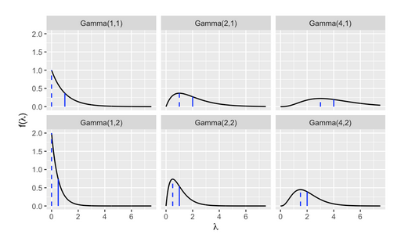

# Conjugate Families

**Learning objectives:**

- Practice building Bayesian models: recognize kernels and use of proportionality. 

- Familiarize yourself with conjugacy: what makes a prior conjugate?  

**Greek letters**

- $\lambda$ = lambda

- $\mu$ = mu

- $\sigma$ = sigma

- $\tau$ = tau

- $\theta$ = theta

This our last chapter on Bayesian foundations!

## Revisiting choice of prior

- Flexibility 

- Computational ease: posterior easy to build

- Interpretability

### **Reminder** the Beta-Binomial Model:

1. Prior: $Beta (\alpha, \beta)$

2. Data model: $Y = y \quad for \quad Bin(n, \pi)$  

3. Posterior: $Beta(\alpha + y, \beta + n - y)$ 

### Conjugate prior: 

$f(\theta|y) \propto f(\theta)L(\theta|y)$


## Gamma-Poisson conjugate family 1/8

We are going to do a model to estimate the number of fraud risk phone call: 

**Prior:**

- rate $\lambda \approx$ 5 number of phone call / day

- can range from 2-7

- positive values

**Collect data:**

- $Y_i$ is a count and can only be positive integers {0, 1, 2, ... n}

- $Y_i$ not limited by number of trials n (like we saw in Binomial). 

**Introducing the Gamma-Poisson conjugate family!!!** 


### Poisson **data** model:

$Y$ = number of *independent* events that occur in a fixed amount of time

$$Y|y \sim Pois(\lambda) $$

Probability mass function (sum to 1):


$$f(y|\lambda) =  \frac{\lambda^y e^{-\lambda}}{y!}\;\; \text{ for } y \in \{0,1,2,\ldots\}$$


$$E(Y|\lambda) = Var(Y|\lambda) = \lambda $$

### Poisson pmfs with different $\lambda$

```{r, fig.dim=c(8,4), echo=FALSE}
par(mfrow = c(1,3), mar = c(2,3,1,1))
x <- 0:12; f <- dpois(x, lambda = 1)
plot(x, f, type = "h", col = "blue", xlab = "", ylab="f(y)", main = "Pois(1)")
x <- 0:12; f <- dpois(x, lambda = 2)
plot(x, f, type = "h", col = "blue", xlab = "", ylab="f(y)",  main = "Pois(2)")
x <- 0:12; f <- dpois(x, lambda = 5)
plot(x, f, type = "h", col = "blue", xlab = "",ylab="f(y)",  main = "Pois(5)")
```


### Joint probability mass function

We have pmf for each day but if we want for $n$ day we need to use joint probably mass function. (product of every pmf) 

$$L(\lambda|\overrightarrow{y}) = \frac{\lambda^{\sum y_i  e^{-n\lambda}}}{\prod_{i=n}^{n} y!}  \propto e^{-n\lambda} \lambda^{\sum y_i}$$ 

We just need : $n$ and $\sum y_i$

### Potential priors?

$\lambda$ is *postif* and *continuous* 

We have 3 probability models : 

- Gamma : $f(\lambda) \propto \lambda^{s-1} e^{-r\lambda}$

- Weibull : $f(\lambda) \propto \lambda^{s-1} e^{(-r\lambda)^s}$

- F : $f(\lambda) \propto \lambda^{s/2 - 1} (1 + \lambda) ^ -s$ 

**Quiz! Which one ?**


### Gamma prior : Gamma and Exponential models

$\lambda$ continuous random variable but can only take + value

$$\lambda \sim Gamma(s, r)$$

Probability density functions: 

$$f(\lambda) = \frac{r^s}{\Gamma (s)} \lambda^{s - 1} e^{-r\lambda} \quad for \quad \lambda > 0  $$ 

Central Tendency: 
$$ E(\lambda) = \frac{s}{r}$$ 
$$Mode(\lambda) = \frac{s - 1}{r} \quad for \quad s \geq 1$$ 
$$Var(\lambda) = \frac{s}{r^2} $$ 

When s = 1, the **Exponential model = Gamma(1,r)**

$$\lambda \sim Exp(r)$$ 

## Gamma-Poisson conjugate family 6/n

### Quiz!

- Gamma when s > r ? 

- Gamma when s < r ?

- More variability in Gamma(20, 20) or Gamma(20, 100) ? 



dashed = modes

solid = means

### Applications! 

$$ E(\lambda) = \frac{s}{r} \approx 5$$

-> we need $s = 5r$

Trial and error:

```{r}
bayesrules::plot_gamma(shape = 10, rate = 2)
```

Yeahhhh! we have a Prior!


### Gamma-Poisson conjugacy

Now need a posterior! Because we are using a Gamma prior for the rate parameter ($\lambda$) and a Poisson moel for the data Y

$$ \lambda|\overrightarrow{y} \sim Gamma(s + \sum y_i, r +n)  $$
We have: Gamma(10,2) and as data: $\overrightarrow{y} = (6 + 2 + 2+ 1 )$ , $n = 4$


$$\sum_{i = 1}^{4} = 6 + 2 + 2 + 1 =11$$

$$\overline{y} = \frac{\sum_{i = 1}^{4}}{4} = 2.75$$


$$L(\lambda|\overrightarrow{y}) =  \frac{\lambda^ye^{-n\lambda}}{y!}$$

$$L(\lambda|\overrightarrow{y}) =  \frac{\lambda^{11}e^{-4\lambda}}{6!2!2!1!} \propto \lambda^{11}e^{-4\lambda}$$

```{r}
bayesrules::plot_poisson_likelihood(y = c(6, 2, 2, 1), lambda_upper_bound = 10) 
```


We have prior, data, likelihood -> posterior

$$Gamma(10, 2) \longrightarrow  Gamma(s + \sum y_i, r +n)$$ 

$$\lambda|\overrightarrow{y} \sim Gamma(21, 6) $$

```{r}
bayesrules::plot_gamma_poisson(shape = 10, rate = 2, sum_y = 11, n = 4)
```


## Why no simulation in this chapter? 

Hard to do!

We moved from sample size 1 -> $n$


## Critiques of conjugate family

- Less flexible in selecting the prior

- Some conjugtes do not allow flat priors


## Summary

- Conjugate priors are easy to compute/derive, easy to interpret

- Beta-Binomial: data Y is the number of successes in a set of $n$ trials 

- Gamma-Poisson: Y is a count with no upper limit

- Normal-Normal: Y is continuous 


## Meeting Videos

### Cohort 1

`r knitr::include_url("https://www.youtube.com/embed/8ley3O5O070")`


### Cohort 2

`r knitr::include_url("https://www.youtube.com/embed/DwNDC_QWgag")`


### Cohort 3

`r knitr::include_url("https://www.youtube.com/embed/URL")`

<details>
<summary> Meeting chat log </summary>

```
LOG
```
</details>
